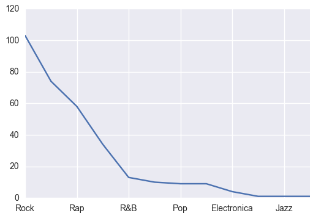
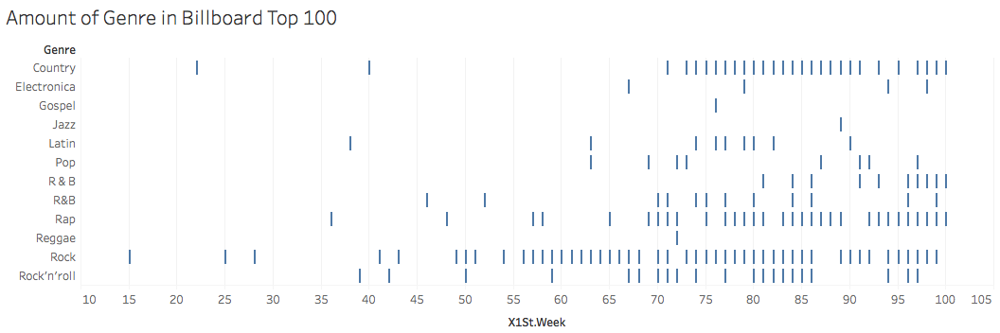

For Project 2, I was given the opportunity to really test my data munging
skills on a dataset that included Billboard Top 100 chart hits from the early
2000's (a.k.a. my guilty pleasure). This data was both a blast from the past and
a great opportunity to create a hypothesis that could lead us to discover deeper
correlations within the dataset.

Upon first glancing at the data, I noticed that the "genre" category seemed
outdated and was very limited in it's scope (at least to the modern eye).Upon
further research, I learned that these genre labels were created as demographic
markers and were created to predict and track the popularity of a song. [source: <http://fusion.net/story/158119/streaming-top-40/>] After learning this
information, I then made it my hypothesis to see whether these labels really
did an accurate job of tracking the success, or rate of success, of a certain
genre by tracking the prevalance of a genre at the top of the charts. This
would hopefully show a correlation between the method of labeling and whether
it is accurate or not. Also, it would show how successfully a genre tended to
debut to radio listeners. I also liked this hypothesis because it showed the
audience's immediate response to a song, and I believe that is important in
determining how and why songs are labeled the way they are.

I began by creating a problem statement that asked whether the genre of a song
would have an impact on popularity of a song's debut. I then judged the
popularity of a song by it's debut position on the Billboard Chart. By obtaining
the song's debut position on the chart, I would then find the genre and then
explore the data to see how many times this genre appeared on the chart and how
high it tended debuted.

Upon sorting through the data and taking a quick glance, I noticed that the
data was hinting that the genre "Rock" appeared the most frequently. I found
this interesting as even songs that appeared to not fall into the "Rock"
category (such as Destiny's Child "Independent Woman Part I") were labeled as
such. The label "R & B" did exist but it was not labeled as such. This hinted
that it may not be about actual "genre", but that a genre label was instead
predicting a song's success and demographic reach (I mean... who doesn't love
Beyoncé?) I took a quick data count and saw this when plotting when beginning
my data exploration:

My hypothesis appeared to be correct when sorting through the data and creating
datasets. Not only did the the genre "Rock" appear the most frequently in the
data, it also tended to debut higher than all the other genres. This certainly
shows a correlation between the purpose of a label and the purpose it serves in
organizing and collecting data for the Billboard organization. However, the
correlation in my data doesn't hint at a causation-correlation.

All in all, this data analysis taught me the importance of labels and that
they are metrics that the organization creates for their own measuring
purposes. They do not need to follow cut and dry recipe and definition for a
key-word. It is simply a unit to track data and it's reach and Billboard did
just that when using these seemingly anomalous labels.

